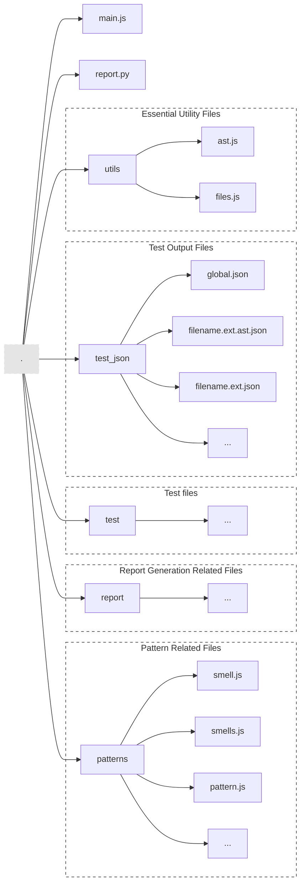

# File Struture

```mermaid
graph LR
    root[.] --> 1[main.js] 
    root --> 2[report.py]
    root --> 3[patterns]
    root --> 4[report]
    root --> 5[test]
    root --> 6[test_json]
    root --> 7[utils]
    subgraph 3g[Pattern Related Files]
        3 --> 31[smell.js]
        3 --> 32[smells.js]
        3 --> 33[pattern.js]
        3 --> 34[...]
    end
    subgraph 4g[Report Generation Related Files]
        4 --> 41[...]
    end
    subgraph 5g[Test files]
        5 --> 51[...]
    end
    subgraph 6g[Test Output Files]
        6 --> 61[global.json]
        6 --> 62[filename.ext.ast.json]
        6 --> 63[filename.ext.json]
        6 --> 64[...]
    end
    subgraph 7g[Essential Utility Files]
        7 --> 71[ast.js]
        7 --> 72[files.js] 
    end

    style root fill:#E5E5E5,stroke:#E5E5E5,stroke-width:1px,stroke-dasharray:5;
    style 3g fill:transparent,stroke:#323232,stroke-width:1px,stroke-dasharray:5;
    style 4g fill:transparent,stroke:#323232,stroke-width:1px,stroke-dasharray:5;
    style 5g fill:transparent,stroke:#323232,stroke-width:1px,stroke-dasharray:5;
    style 6g fill:transparent,stroke:#323232,stroke-width:1px,stroke-dasharray:5;
    style 7g fill:transparent,stroke:#323232,stroke-width:1px,stroke-dasharray:5;
```
